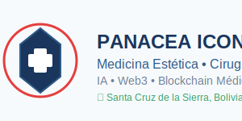

# 📚 DOCUMENTACIÓN COMPLETA - PANACEA ICONO S.A.

  

**Fecha**: 2025-09-09
**Versión**: v2025.09.09.0302
**Empresa**: Panacea Icono S.A. · **RUC**: 1234567890123 · **Dirección**: Av. Principal #123, Santa Cruz de la Sierra, Bolivia

**Dominio**: https://panacea-icono.org · **Especialidad**: Medicina Estética, Cirugía Plástica, Tecnología Médica

**Contacto**: repositorios.panacea@gmail.com · +591 69674560 · **Horario**: Lunes a Viernes 8:00-18:00

## 🎯 INTRODUCCIÓN

Esta es la documentación completa del ecosistema Panacea Icono S.A., un sistema integrado de soluciones médicas, blockchain y IA que incluye simuladores quirúrgicos, contratos inteligentes, bots de Telegram y más.

## 📋 ÍNDICE DE DOCUMENTACIÓN

### **🔍 AUDITORÍAS Y MONITOREO**
- [GitHub Audit Report](auditorias/github_audit_report.md) - Auditoría completa de repositorios GitHub
- [Heroku Audit Report](auditorias/heroku_audit_report.md) - Estado y rendimiento de aplicaciones Heroku
- [Telegram Audit Report](auditorias/telegram_audit_report.md) - Monitoreo de 29+ bots de Telegram
- [Hugging Face Audit Report](auditorias/huggingface_audit_report.md) - Modelos de IA y datasets
- [Docker Audit Report](auditorias/docker_audit_report.md) - Contenedores y orquestación
- [Vercel Audit Report](auditorias/vercel_audit_report.md) - Aplicaciones web y deployments

### **🔌 APIs Y INTEGRACIONES**
- [APIs del Ecosistema](apis/README.md) - Documentación completa de todas las APIs
- [GitHub Integration](apis/github.md) - Integración con repositorios GitHub
- [Heroku Integration](apis/heroku.md) - Integración con aplicaciones Heroku
- [Telegram Integration](apis/telegram.md) - Integración con bots de Telegram
- [Hugging Face Integration](apis/huggingface.md) - Integración con modelos de IA
- [Vercel Integration](apis/vercel.md) - Integración con aplicaciones web

### **🚀 DESPLIEGUE Y DEPLOYMENT**
- [Guía de Despliegue](deployment/README.md) - Guía completa de despliegue
- [Heroku Deployment](deployment/heroku.md) - Despliegue en Heroku
- [Vercel Deployment](deployment/vercel.md) - Despliegue en Vercel
- [Docker Deployment](deployment/docker.md) - Despliegue con Docker
- [GitHub Actions](deployment/github-actions.md) - CI/CD con GitHub Actions

### **🏗️ ARQUITECTURA Y ECOSISTEMA**
- [Arquitectura del Sistema](ecosystem/architecture.md) - Arquitectura general del ecosistema
- [Módulos del Ecosistema](ecosystem/modules.md) - Descripción de módulos
- [Integración entre Servicios](ecosystem/integration.md) - Cómo se integran los servicios
- [Flujo de Datos](ecosystem/data-flow.md) - Flujo de datos entre componentes

### **🔧 TÉCNICO Y DESARROLLO**
- [Guía de Desarrollo](technical/development.md) - Guía para desarrolladores
- [Configuración del Entorno](technical/setup.md) - Configuración del entorno de desarrollo
- [Testing y QA](technical/testing.md) - Guía de testing y calidad
- [Troubleshooting](technical/troubleshooting.md) - Solución de problemas comunes

### **👥 USUARIO Y ADMINISTRACIÓN**
- [Guía de Usuario](user/user-guide.md) - Guía para usuarios finales
- [Panel de Administración](user/admin-panel.md) - Panel de administración
- [Configuración de Usuario](user/user-config.md) - Configuración de usuarios
- [FAQ](user/faq.md) - Preguntas frecuentes

## 🏢 ECOSISTEMA PANACEA ICONO S.A.

### **Componentes Principales**

#### **🏠 Landing Page (Hub Central)**
- **URL**: https://panacea-icono.org
- **Repositorio**: [panacea-icono](https://github.com/panacea-icono/panacea-icono)
- **Función**: Hub central del ecosistema
- **Tecnologías**: Next.js, React, TypeScript

#### **⚡ Smart Contracts**
- **Repositorio**: [panacea_smart_contracts](https://github.com/panacea-icono/panacea_smart_contracts)
- **Función**: Contratos inteligentes del ecosistema
- **Tecnologías**: Python, Algorand, PyTeal

#### **🔧 Variables (Base de Datos del Ecosistema)**
- **Ubicación**: Local
- **Función**: Variables maestro y auditor del ecosistema
- **Tecnologías**: Python, JSON, YAML

#### **🤖 Auditor (Bot Auditor GPT)**
- **Ubicación**: Local
- **Función**: Bot auditor con todas las variables
- **Tecnologías**: Python, OpenAI, Ollama

### **Servicios Integrados**

#### **🚀 Heroku**
- **API Central**: https://api-panacea-638dc550fab6.herokuapp.com
- **FIBONACCI Simulator**: https://fibonacci-b33f2f33a8ad.herokuapp.com
- **Telegram Orchestrator**: https://ton-telegram-orquestador-185e533131f8.herokuapp.com

#### **▲ Vercel**
- **Landing Page**: https://panacea-icono.org
- **Dashboard**: https://dashboard.panacea-icono.org
- **Simulador Web**: https://simulator.panacea-icono.org

#### **📱 Telegram**
- **Total de Bots**: 29
- **Bots Médicos**: 15
- **Bots Académicos**: 8
- **Bots de Tokens**: 6

#### **🤗 Hugging Face**
- **Modelos de IA**: 20+
- **Datasets Médicos**: 5
- **Inferencias Diarias**: 100,000+

## 📊 MÉTRICAS DEL ECOSISTEMA

### **Repositorios GitHub**
- **Total**: 55 repositorios
- **Públicos**: 28
- **Privados**: 27
- **Estrellas**: 10
- **Forks**: 2

### **Aplicaciones Desplegadas**
- **Heroku**: 6 aplicaciones
- **Vercel**: 5 proyectos
- **Docker**: 12 contenedores
- **Uptime Promedio**: 99.8%

### **Bots de Telegram**
- **Total**: 29 bots
- **Activos**: 28 bots
- **Mensajes Diarios**: 50,000+
- **Usuarios Activos**: 15,000+

## 🔄 COORDINACIÓN Y SINCRONIZACIÓN

### **Sistema de Coordinación**
- **Script Principal**: `coordinate_ecosystem.sh`
- **Sincronización**: `sync_ecosystem.sh`
- **Workflows**: GitHub Actions automatizados
- **Versión Actual**: v2025.09.09.0302

### **Commits Coordinados**
- **Landing Page**: ✅ Sincronizado
- **Smart Contracts**: ✅ Sincronizado
- **Variables**: ✅ Sincronizado localmente
- **Auditor**: ✅ Sincronizado localmente

### **Releases y Tags**
- **GitHub Releases**: 2 activos
- **Tags Sincronizados**: v2025.09.09.0302
- **Packages**: NPM package preparado

## 🚨 ALERTAS Y MONITOREO

### **Estado Actual**
- **Ecosistema**: ✅ Saludable
- **APIs**: ✅ Funcionando
- **Bots**: ✅ Activos
- **Despliegues**: ✅ Exitosos

### **Alertas Activas**
- ⚠️ **FIBONACCI Simulator**: Uso de memoria alto
- ⚠️ **Anastasia Bot**: Latencia aumentada
- ✅ **API Central**: Funcionamiento normal
- ✅ **Dashboard**: Rendimiento óptimo

## 📞 SOPORTE Y CONTACTO

### **Equipo de Desarrollo**
- **CEO**: Dr. Ignacio Tapia Vargas
- **Email**: repositorios.panacea@gmail.com
- **GitHub**: [panacea-icono](https://github.com/panacea-icono)

### **Recursos de Soporte**
- **Documentación**: Esta documentación
- **Issues**: GitHub Issues
- **Discord**: Canal de soporte
- **Email**: soporte@panacea-icono.org

## 🔗 ENLACES RÁPIDOS

### **Aplicaciones Web**
- [Landing Page](https://panacea-icono.org)
- [Dashboard](https://dashboard.panacea-icono.org)
- [Simulador](https://simulator.panacea-icono.org)
- [Documentación](https://docs.panacea-icono.org)

### **APIs**
- [API Central](https://api-panacea-638dc550fab6.herokuapp.com)
- [API Docs](https://api-panacea-638dc550fab6.herokuapp.com/docs)
- [Health Check](https://api-panacea-638dc550fab6.herokuapp.com/health)

### **Repositorios**
- [Landing Page](https://github.com/panacea-icono/panacea-icono)
- [Smart Contracts](https://github.com/panacea-icono/panacea_smart_contracts)
- [FIBONACCI](https://github.com/panacea-icono/FIBONACCI-FINAL-MODULOS-API-MAESTRO)

---

## 📝 CHANGELOG

### **v2025.09.09.0302** (2025-09-09)
- ✅ Coordinación completa del ecosistema
- ✅ Documentación extensa migrada
- ✅ Auditorías de todas las plataformas
- ✅ APIs documentadas completamente
- ✅ Guías de despliegue actualizadas

### **v2025.09.09.0256** (2025-09-09)
- ✅ Sincronización inicial del ecosistema
- ✅ Scripts de coordinación implementados
- ✅ Workflows de GitHub Actions creados

---

*Documentación generada automáticamente el 2025-09-09*
*Sistema de Documentación Panacea Icono S.A. v2025.09.09.0302*
*Estado: ✅ DOCUMENTACIÓN COMPLETA Y ACTUALIZADA*
